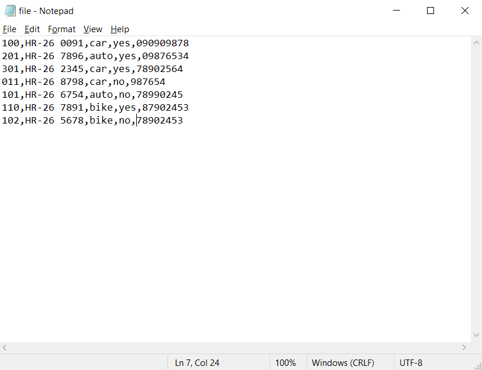
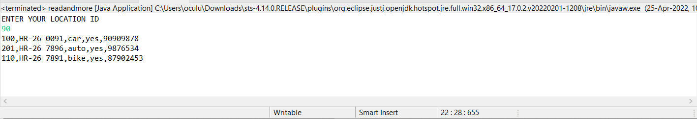

# CabBookingSys
cab booking cli ; reads file - recommends nearest vehicles

## Text file used:
format(locationId,vehicleNo,vehicleCategory,availability,contactNumber)

## nearest car,auto and bike recommendations with vehicle no,vehical type and drivers contact number!
input-90

